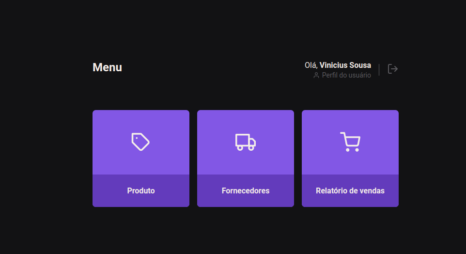

# E-stock

e-Stock é um esboço de um sistema para gerenciamento de estoque. O projeto inclui tanto o backend quanto o frontend da aplicação. O backend foi desenvolvido em Node.js, oferecendo uma API robusta para operações CRUD (criação, leitura, atualização e exclusão) de itens de estoque. O frontend, desenvolvido em React, proporciona uma interface moderna e responsiva, permitindo aos usuários visualizar, adicionar, editar e remover itens de estoque facilmente.  

### :arrow_forward: Rodando o projeto
Dentro do projeto a o back-end e front-end.

###### Rodando a API e o Back-end

1. Abra a pasta `API` em um terminal separado.
2. Rode o comando `npm install`, para instalar as dependências.
3. Rode o comando `npm run migrate`, para criar o banco de dados.
4. Rode o comando `npm run dev`, para rodar o projeto. 

###### Rodando o Front-end

6. Abra a pasta `WEB` em um terminal separado. 
7. Rode o comando `npm install`, para instalar as dependências.
8. Rode o comando `npm run dev`, para rodar o projeto. 

### :atom_symbol: Tecnologias 
* [Node](https://nodejs.org/en)
* [Express](https://expressjs.com/pt-br/)
* [JsonWebToken](https://www.npmjs.com/package/jsonwebtoken)
* [Knex.js](https://knexjs.org/)
* [Multer](https://www.npmjs.com/package/multer)
* [bcrypt.js](bcrypt.js)
* [SQLite](https://www.sqlite.org/)
* [React](https://react.dev/)
* [Axios](https://axios-http.com/ptbr/docs/intro)
* [Styled Components](https://styled-components.com/)

### :computer_mouse: Features
* Criar um novo usuário
* Cadastrar produto
* Ver lista de produtos cadastrado
* Tela para fornecedores.
* Relatório de venda.

### :desktop_computer: Previa do projeto

